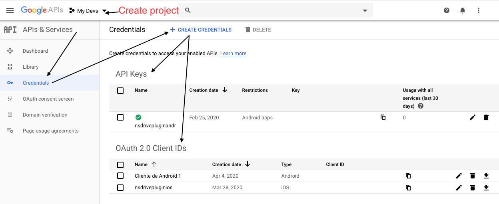
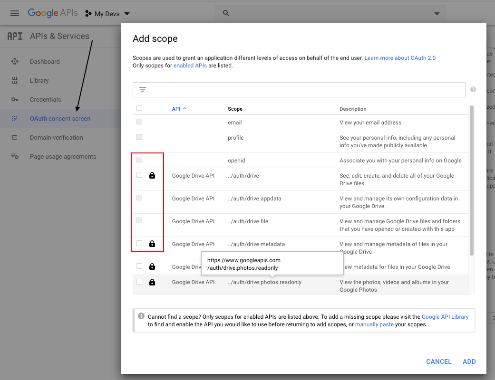

# Nativescript Google Drive  

[![NPM version][npm-image]][npm-url]
[![Downloads][downloads-image]][npm-url]
[![TotalDownloads][total-downloads-image]][npm-url]

[npm-image]:http://img.shields.io/npm/v/nativescript-google-drive.svg
[npm-url]:https://npmjs.org/package/nativescript-google-drive
[downloads-image]:http://img.shields.io/npm/dm/nativescript-google-drive.svg
[total-downloads-image]:http://img.shields.io/npm/dt/nativescript-google-drive.svg?label=total%20downloads

 Google Drive

Upload, retrieve and delete files from you Nativescript app to Google Drive  

## Prerequisites

First to all, if you don't have a google account [create one](https://accounts.google.com) *(I think most people have one 😝)*. <br/>

Go to [console.developers.google.com](https://console.developers.google.com)

* Create a project
* Use the menu to go **APIs ands Services** option and then to *Dashboard*
* Add **Google Drive API** using the *Enable APIs and Services* button on the top bar
* On **Credentials** create a credential using the *Create Credentials* button on the top bar
    * Create API key for Android
    * Create OAuth 2.0 client id credential for Android and iOS 
* On OAuth Consent screen option create or edit and follow the instruction
    * Add Scope *drive.file*, *drive.appdata*, *drive.metadata* or *drive*




# iOS

You need to go to the google developer console, open the OAuth 2.0 Client Id create for iOS and copy the `iOS URL scheme` (REVERSED_CLIENT_ID) or download the plist. 

Take the code below and paste it in `App_Resources/iOS/Info.plist` and replace REVERSED_CLIENT_ID

```xml
<key>CFBundleURLTypes</key>
<array>
    <dict>
        <key>CFBundleTypeRole</key>
        <string>Editor</string>
        <key>CFBundleURLSchemes</key>
        <array>
            <string>[Add here the REVERSED_CLIENT_ID]</string>
        </array>
    </dict>
</array>
```

## Installation

To install this Nativescript plugin in your project just type or (copy and paste) the command below in the console:

```bash
tns plugin add nativescript-google-drive
```

## Usage 
	
```typescript
import { isIOS } from "tns-core-modules/platform";

import { GoogleDriveHelper, SPACES, Config } from "nativescript-google-drive";
import * as ThreadWorker from "nativescript-worker-loader!nativescript-google-drive/thread-worker";

const config: Config = {
    space: SPACES.APP_DATA_FOLDER, /*[DRIVE|APP_DATA_FOLDER]*/
    worker: ThreadWorker
};
// iOS need this extra the clientID
if (isIOS) {
    config.clientId = [CLIENT_ID];/*OAuth 2.0 client Id*/
}

GoogleDriveHelper.signInOnGoogleDrive(config)
.then((helper: GoogleDriveHelper) => {
    // TODO
})
.catch((err) => {
    // handler error
});

```
> If you have some issues using this plugin with an Angular Nativescript app with the worker loader, [read this](https://github.com/NativeScript/worker-loader) and take a look at the Angular demo app.

## API

### signInOnGoogleDrive

```typescript
/**
 * This method start Google SignIn flow and ask for Gogole Drive permissions to the user
 * and initialize a drive helper class
 * @static @function
 *
 * @param {Config} config
 *
 * @returns {Promise<GoogleDriveHelper>}
 */
static signInOnGoogleDrive(config: Config): Promise<GoogleDriveHelper>;
```

```typescript
const config: Config = {
    space: SPACES.APP_DATA_FOLDER, /*[DRIVE|APP_DATA_FOLDER]*/
    worker: ThreadWorker
};
// iOS needs the clientID
if (isIOS) {
    config.clientId = [CLIENT_ID];/*OAuth 2.0 client Id*/
}

GoogleDriveHelper.signInOnGoogleDrive(config)
.then((helper: GoogleDriveHelper) => {
    // TODO
})
.catch((err) => {
    // handler error
});
```
The `Config` interface's properties

| Property | Type | Description |
| --- | --- | --- |
| space | `string` | Required on `Android, iOS`. Specify the drive scope or space to work on `SPACES.APP_DATA_FOLDER` or `SPACES.DRIVE` |
| worker | `Object` | Required on `Android, iOS`. The worker thread to execute all the operations |
| clientId | `string` | Required on `iOS`. The OAuth 2.0 client Id|
| extraDriveScopes | `Array<string>` | Optional on `Android, iOS`. To specify more scope|

### createFile
```typescript    
/**
 * Create a file with the specified metadata in Google Drive
 *
 * @param {FileInfoContent} fileInfo file metadata
 *
 * @returns {Promise<string>} created file id
 */
createFile(fileInfo: FileInfoContent): Promise<string>;
```
The `FileInfoContent` interface's properties

| Property | Type | Description |
| --- | --- | --- |
| content | `string or File` | Content of the file |

> `FileInfoContent` extends `FileInfo`

### updateFile
```typescript 
/**
 * Update a file content in Google Drive.
 * If you want to update the metadata, you have to required permission to metadata scope to the user.
 *
 * @param {FileInfoContent} fileInfo file metadata
 *
 * @returns {Promise<string>} created file id
 */
updateFile(fileInfo: FileInfoContent): Promise<boolean>;
```
### readFileContent
```typescript 
/**
 * Read the content of plain text file
 * @param {string} driveFileId
 *
 * @returns {Promise<string>} text contained in the file
 */
readFileContent(driveFileId: string): Promise<string>;
```
### deleteFile
```typescript 
/**
 * Delete a file
 * @param {string} driveFileId
 *
 * @returns {Promise<boolean>} deleted or not
 */
deleteFile(driveFileId: string): Promise<boolean>;
```
### downloadFile
```typescript 
/**
 * Download a file
 * @param {string} driveFileId
 *
 * @returns {Promise<File>} file downloaded
 */
downloadFile(driveFileId: string): Promise<File>;
```
### uploadFile
```typescript 
/**
 * Upload a file with the specified metadata in Google Drive
 *
 * @param {FileInfo} fileInfo file metadata
 *
 * @returns {Promise<string>} uploaded file id
 */
uploadFile(fileInfo: FileInfo): Promise<string>;
```

The `FileInfo` interface's properties

| Property | Type | Description |
| --- | --- | --- |
| name | `string` | Required. Name of the file |
| mimeType | `string` | MimeType of the file |
| id | `string` | Id of the file |
| description | `string` | Description of the file |
| parentId | `string` | Parent Id of the file |
| createdTime | `Date` | Time of when the file was uploaded|
| size | `number` | Size of the file in kb |

### listFilesByParent
```typescript 
/**
 * List all the files contained in the parent or root folder
 * @param {string} parentId parent folder OPTIONAL
 *
 * @returns {Promise<Array<FileInfo>>} file list
 */
listFilesByParent(parentId?: string): Promise<Array<FileInfo>>;
```
### searchFiles
```typescript 
/**
 * Search files in Google Drive with the given metadata.
 *
 * @param {FileInfo} fileInfo file metadata to search for
 *
 * @returns {Promise<Array<FileInfo>>} file list matched
 */
searchFiles(fileInfo: FileInfo): Promise<Array<FileInfo>>;
```
### createFolder
```typescript 
/**
 * Create a folder with the given metadata. The content property is ignore
 * @param {FileInfo} fileInfo folder metadata
 *
 * @returns {Promise<string>} created folder id
 */
createFolder(fileInfo: FileInfo): Promise<string>;
```
### findFolder
```typescript 
/**
 * Find folders by name
 *
 * @param {string} name
 *
 * @returns {Promise<Array<FileInfo>>} folder list
 */
findFolder(name: string): Promise<Array<FileInfo>>;
```
### signOut
```typescript 
/**
 * Disconnect the google drive account
 * @returns {Promise<boolean>}
 */
signOut(): Promise<boolean>;
```